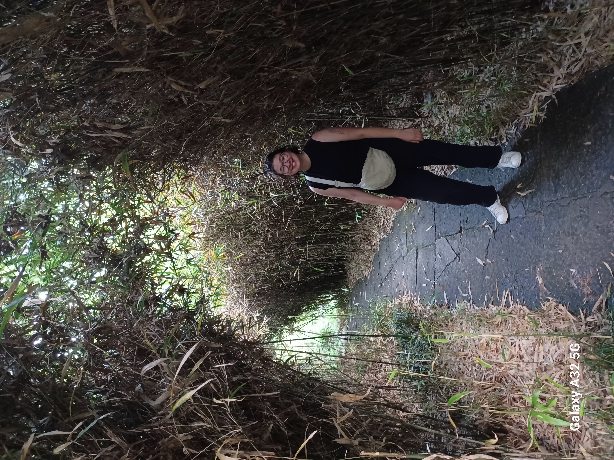

<head>
<meta charset="utf-8">

<link rel="stylesheet" href="styles.css">
</head>
<figure style="float:right;width:25%"></figure>

<h1><a href="README.md">Max Hlavacek</a></h1>

<i>
e-mail: <a href="mailto:mhap2023@pomona.edu">mhap2023@pomona.edu</a> 
office: Estella 2339  
Department of Mathematics and Statistics 
Pomona College 

</i>

Hi there!  I am a visiting assistant professor at Pomona College.  I am primarily interested in discrete geometry and geometric combinatorics, including topics such as lattice point enumeration and Ehrhart theory. I love to talk about math with students, so please do not hesitate to email me! 

I use they/them pronouns.

<h2 style="color:dimgrey"><a href="papers.html">research</a> | <a href="talks.html">teaching</a> | <a href="conferences.html">activities</a> </h2>

